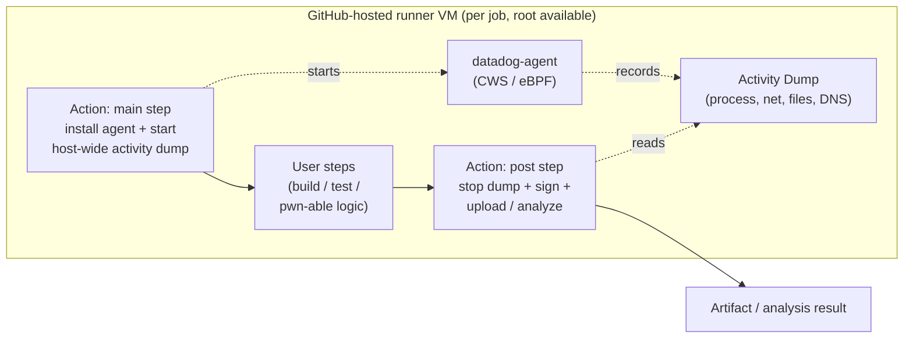
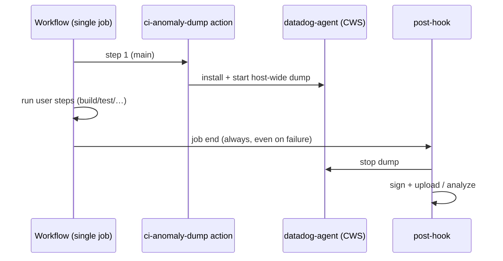
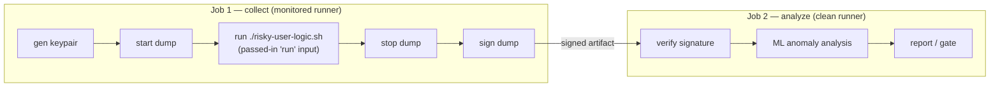
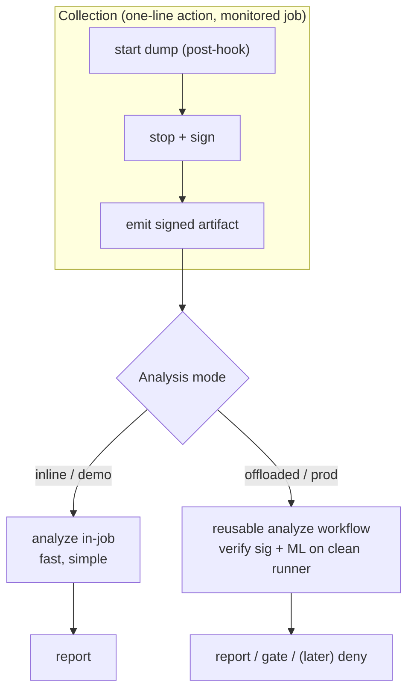
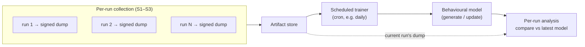
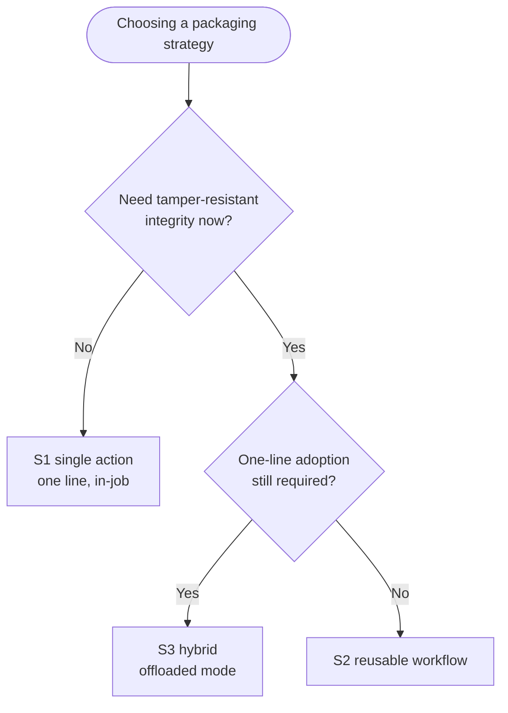

# Architecture — CWS Activity-Dump Anomaly Detection in CI/CD

> **Focus of this document:** how to package the runtime collector as a **GitHub Action**.
> It lays out the viable implementation strategies (a single action with steps, and reusable-workflow
> approaches) with pros/cons for each. Every strategy is valid — the reader picks based on their needs.
> Everything else (dump format, ML model, transport) is deliberately kept as light context.
>
> **Project / code (GitHub Actions):** https://github.com/sobregosodd/anomalous

---

## 1. Context & scope

**Threat model.** CI jobs behave consistently run-to-run, so we can learn a behavioural baseline
and flag deviations. The interesting deviations are the classic GitHub Actions pwn cases —
`pull_request_target`, `workflow_run`, and `issue_comment` workflows that execute attacker-influenced
code with elevated privileges. We capture a **Datadog CWS Activity Dump** (process lineage, network
connections, open files, DNS) on the runner during a job and compare it against the learned model.

**Assumptions.** GitHub-hosted runners (full VM per job, `sudo`/root available, but **no pre-baked
agent** — collection is installed and started within the run), and a **detect-first** posture with a
clean path to deny/blocking later.

**Out of scope here:** dump binary schema, model training/regeneration, artifact retention policy,
self-hosted/ephemeral runner images.

---

## 2. Background primer (only what affects packaging)

- **Collector dependency.** Runtime data collection is performed by the upstream
  [Datadog Agent](https://github.com/datadog/datadog-agent) and its Cloud Workload Security (CWS)
  activity dumps, which Anomalous installs and runs on the runner.
- **What a dump gives us.** An Activity Dump is a per-workload behavioural profile: process tree,
  `exec`/`fork` lineage, outbound connections (e.g. `connect.addr.ip != 127.0.0.1`), file opens,
  and DNS requests. That is exactly the signal set needed to spot exfiltration / unexpected tooling.
- **Root & install cost.** eBPF needs root (available via `sudo` on GH-hosted VMs), and the agent
  is installed per-run — an adoption cost that factors into strategy choice.
- **The start-trigger problem.** CWS activity dumps default to starting on `cgroup_write`
  (container start). On a GitHub-hosted runner the user's steps run **on the VM host**, not in a
  child container, so we need a **VM/host-wide dump started explicitly**, not a cgroup-triggered one.
- **The `post:` hook — the load-bearing mechanic.** A GitHub Action can declare a `post:` entry
  (`runs.post`), which GitHub runs automatically at the **end of the job**, even if later steps
  fail. This is what lets a **single action added as the first step** wrap the entire job: start the
  dump on entry, stop + collect it on `post`. Note `post:` is only supported by **JavaScript (Node)
  and Docker** actions — **composite actions cannot declare a post step** (and their steps can't even
  use `if: always()`). So the collector is a **Node action**, the same choice StepSecurity's
  `harden-runner` makes for this exact reason.



---

## 3. Strategies

> One note that keeps the strategies clean: an **action** runs inside a single job's step context
> and **cannot span multiple jobs** — cross-job orchestration is the job of a **reusable workflow**
> (`workflow_call`). So S1 lives in a single job, while S2/S3 use a reusable workflow.

### S1 — Single Node action with `pre`/`post` hooks (harden-runner model)

One `uses:` line added as the **first step** of the job. Its main entry installs the agent and
starts a host-wide dump in the background; its `post:` entry (auto-run at job end) stops the dump,
signs it, and uploads or analyzes it.

```yaml
# consumer's workflow — the entire adoption surface
steps:
  - uses: sobregosodd/anomalous@v1   # starts on entry, stops+collects on post
  - run: ./build-and-test.sh       # user's existing steps, unchanged
```



**Pros**
- **Single-line adoption** — strongest fit for OSS uptake and a clean demo.
- **Wraps the whole job automatically** via `post:`; captures every user step with no edits.
- `post:` runs **even if a user step fails**, so the dump is always collected.
- No ordering discipline required from the consumer.

**Cons**
- Analysis, if done inline, runs **on the same runner** — compute/time cost inside the job.
- **Self-monitoring integrity risk:** the very job being observed can tamper with its own dump
  before `post:` reads it (signing + off-runner verification, as in S2, mitigates this).
- Captures setup noise too (agent install, checkout) — must be filtered from the baseline.
- Needs root (fine on GH-hosted) — but that means the action itself runs privileged.

---

### S2 — Reusable workflow, multi-job (collect → analyze via signed artifact)

A `workflow_call` reusable workflow. **Job 1** generates a keypair, runs the user's logic under the
dump, and **signs** it. **Job 2** runs on a **fresh runner**, verifies
the signature, and runs the ML analysis where the monitored job cannot reach it.

**Where does user logic run?** Unlike S1, a reusable workflow's jobs are fixed by the *callee* —
the consumer **cannot** drop its own steps between dump-start and dump-stop. So the consumer's logic
is **passed in** (e.g. a `run` input, or a script/action the workflow invokes) and executed **inside
Job 1**, bracketed by the dump:

```yaml
# consumer references a whole workflow and hands it the logic to profile
jobs:
  ci:
    uses: sobregosodd/anomalous/.github/workflows/dump-and-analyze.yml@v1
    with:
      run: ./risky-user-logic.sh   # executed inside Job 1, wrapped by the dump
```



**Pros**
- **Separation of collection and analysis** → real **tamper isolation**: analysis runs where the
  monitored job can't touch it.
- **Integrity across the job boundary** via signing (the keypair sign/verify design).
- Heavy ML is **off the monitored runner**; the profiled job stays fast/clean.
- Natural place to enforce a **gate** (detect → fail the check).

**Cons**
- **Heaviest integration** — the consumer adopts a whole workflow, not a one-liner. Weaker for OSS
  "drop-in" adoption and quick demos.
- Artifact hand-off + signing/verification complexity; extra job spin-up latency.
- GitHub-hosted artifact upload/download overhead between jobs.

---

### S3 — Hybrid: thin collection action + optional downstream analyze workflow

A **thin Node collection action** (S1-style, one line, `post:`-based) produces a **signed dump
artifact**. Analysis is **pluggable**: inline in the same action for a fast demo, **or** offloaded to
a separate reusable **analyze job/workflow** (S2-style) for tamper-resistance and production.



**Pros**
- Keeps **single-line adoption** for the common case (great for OSS + talk demo)…
- …while offering a **clean upgrade path** to the tamper-resistant, off-runner analysis of S2.
- Same contract supports a **detect-now → deny-later** roadmap.
- One collector to standardize; analysis backends can evolve independently.

**Cons**
- Two components to maintain (action + analyze workflow).
- Must define and freeze the **artifact + signing contract** between them up front.

---

## 4. Offline model building (independent of the collection strategy)

The strategies above are **collection** strategies — how a *single* run's dump is captured and
(optionally) checked in the moment. The **behavioural model itself is not built per run.** Regardless
of which strategy is chosen, a **separate, scheduled component** owns the model.

A **cron-driven trainer** (e.g. once a day) reads the **artifacts accumulated across all runs** in the
period and **generates or incrementally updates** the model. Per-run analysis then only *compares*
the current dump against the latest published model — it never trains. This keeps training cost off
the critical path of any individual CI run and lets the baseline stabilize over many runs.



---

## 5. Action-type comparison

For a workload that installs the agent, needs root, and runs a background eBPF collector with a
`post:` hook:

| Action type | Fit for this workload | Notes |
| --- | --- | --- |
| **JavaScript (Node)** | **Best** | First-class `pre`/`post` hooks that run even on failure; orchestrates `sudo` install + background start via shell; no image pull. The collector can stay a thin shim that shells out to the logic. |
| **Docker container** | Workable | Has `post:`, but Linux-only, adds image-pull latency, and host/eBPF instrumentation from inside a container action is awkward — we want host-wide, not container-scoped. |
| **Composite** (shell) | **Not viable for collection** | No `post:` support and steps can't use `if: always()`, so the dump would be lost on any failing run. Fine for the *analyze* action, which needs no post step. |

**Takeaway:** package the collector as a **Node (JavaScript) action** — composite can't guarantee the
`post:` collection step, and Docker adds friction. Composite is still fine for the analyze action.

---

## 6. Comparison matrix

| Criterion | S1 single action | S2 reusable workflow | S3 hybrid |
| --- | --- | --- | --- |
| Adoption effort | ★★★ one line | ★ adopt a workflow | ★★★ one line (+opt-in) |
| Whole-job coverage | ★★★ auto | ★★★ | ★★★ |
| Auto-stop on failure | ★★★ `post:` | ★★ per-job | ★★★ `post:` |
| Tamper isolation / integrity | ★ self-monitored | ★★★ off-runner + signed | ★★★ (offloaded mode) |
| Analysis compute placement | in-job | separate runner | either (pluggable) |
| Latency | ★★★ | ★ extra job | ★★–★★★ |
| Deny-mode extensibility | ★★ | ★★★ gate | ★★★ gate |

★ = weaker, ★★★ = stronger for that criterion.

---

## 7. Strategy-selection flowchart



